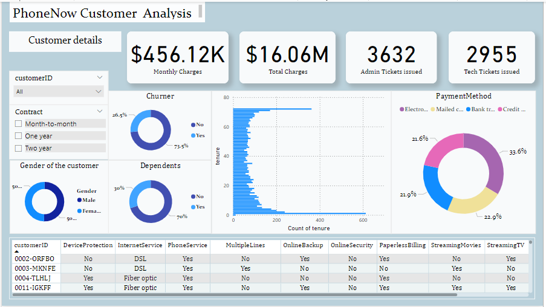
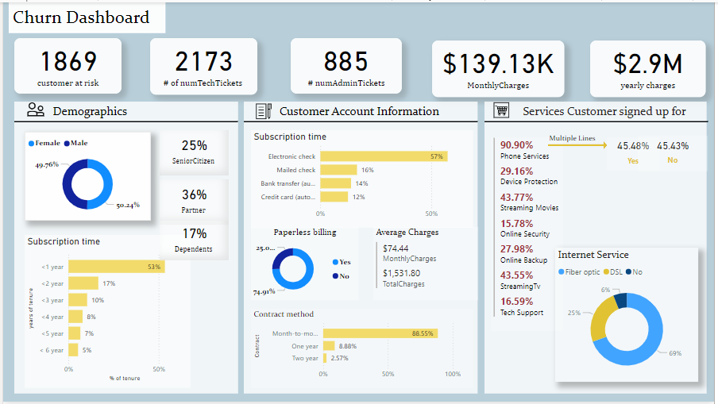
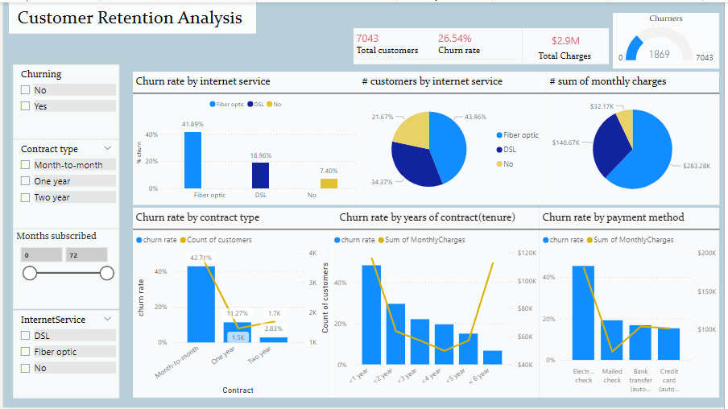

# **PowerBI-Customer-retention-data-analysis**

## **Objective:**

The objective of this case study is to analyze the dataset and extract the information about the churn data to elevate customer retention.

## **Tool Used:**

PowerBI Desktop

## **DataSet:**

The dataset was provided in the form of an excel sheet which contained the customer data about:
- Demographic details 
- Cutomer account information
- Services provided

## Dashboard overview:

## **Overall analysis:**

The analysis gives a breif overview of the factors responsible for the churning of customers. The Power BI dashboard provides visualizations and identifiest these key performance indicators(KPIs):

- **Internet Service**: Fibre optic customers(37.92%) shows to have the highest churning rate of 72.10%.
- **Monthly charges**: Elevated costs may also contribute to the high churn rate, with fiber optic services leading in this regard due to the highest monthly charges of $169.98.
- **Contract type**: Customers with month-to-month contract types exhibited the highest churn rates.
- **Tenure**: The data suggests that customer loyalty improves significantly after the first year. Therefore, retention strategies should focus on supporting customers during their first year of service to reduce churn.
- **Payment method**: The sum of monthly charges is higher for customers using electronic checks, which correlates with the higher churn rate for this group.Encouraging customers to switch to automated payments might be a viable strategy to reduce churn.

